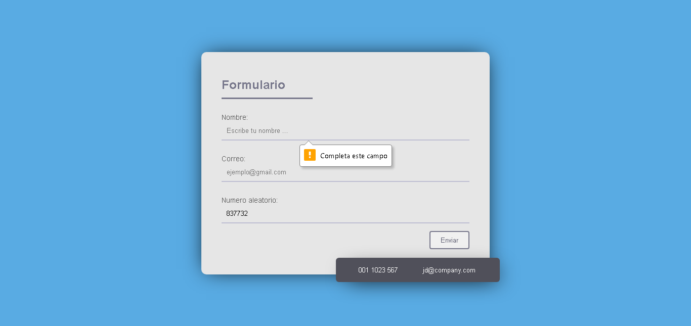
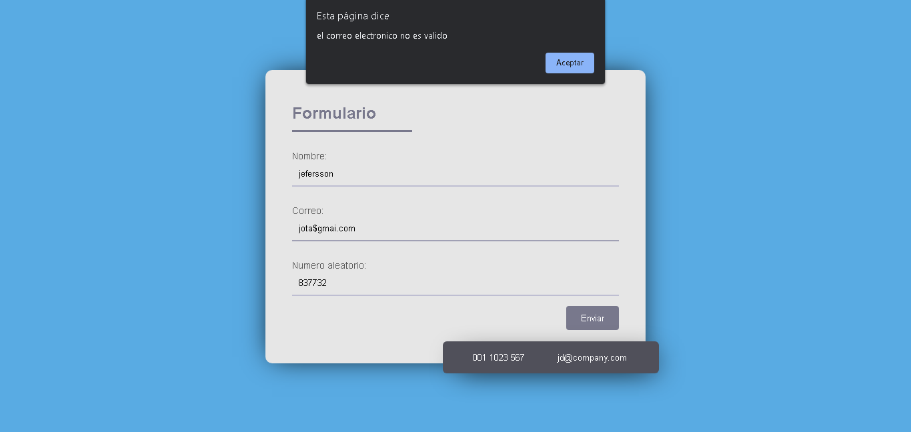
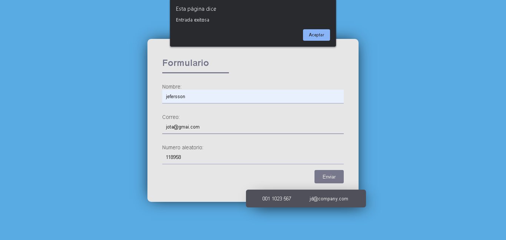
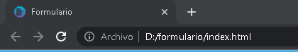

# **Empresa Buho** 
## **proyecto_1**: Formulario
[Ver demo ->](https://github.com/jefersc/project1_buho.git)

## **Funciones principales:**

## "Llenar los campos":

## "Validar el correo":

## "icono de la pagina del formulario":

